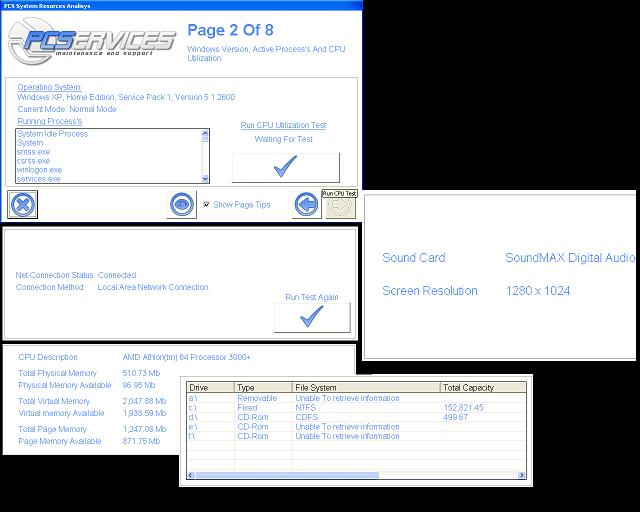



## System Analysis

### Description

This is a compilation of all the useful System analysis tools you made need, Drive-type and space, memory, windows version, net connection, sound card, screen resolution, CPU performance test, Active Aprograms etc.
 
### More Info
 

             |
---                |---
**Submitted On**   |2005-11-18 01:20:28
**By**             |[Steven Atkiss](https://github.com/Planet-Source-Code/PSCIndex/blob/master/ByAuthor/steven-atkiss.md)
**Level**          |Intermediate
**User Rating**    |5.0 (15 globes from 3 users)
**Compatibility**  |VB 5\.0, VB 6\.0
**Category**       |[Windows System Services](https://github.com/Planet-Source-Code/PSCIndex/blob/master/ByCategory/windows-system-services__1-35.md)
**World**          |[Visual Basic](https://github.com/Planet-Source-Code/PSCIndex/blob/master/ByWorld/visual-basic.md)
**Archive File**   |[System\_Ana19516111272005\.zip](https://github.com/Planet-Source-Code/steven-atkiss-system-analysis__1-63402/archive/master.zip)

